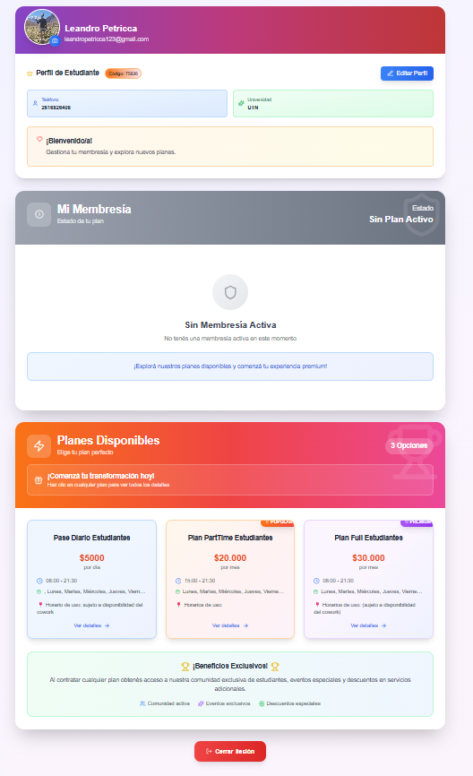
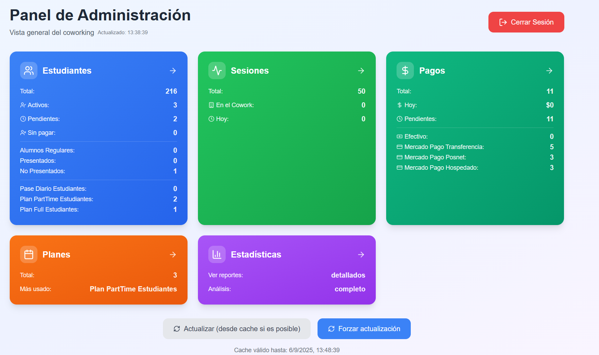
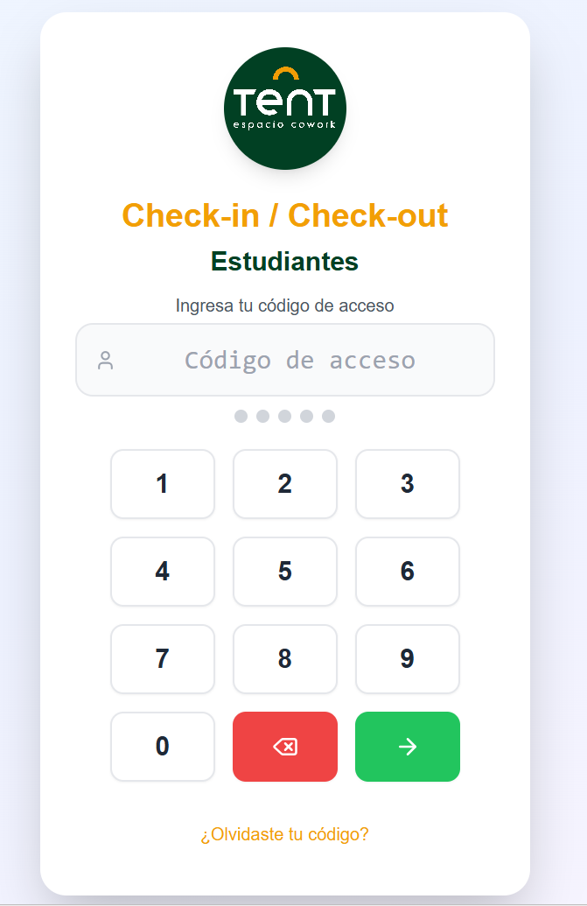

🏢 Sistema de Membresías – Solución Integral para tu Negocio

Desarrollado por: Leandro Petricca

📩 Email: leandropetricca123@gmail.com

📱 Teléfono: 2616826408
🔗 LinkedIn: linkedin.com/in/josé-leandro-petricca-de-luca-638a50230

✨ ¿Qué es este sistema?

Una plataforma digital diseñada para espacios con planes de suscripción: coworkings, gimnasios, academias, estudios de yoga, talleres y mucho más.

👉 Actualmente, TentCowork ya lo utiliza con éxito para gestionar a sus estudiantes de forma ágil y segura.

🚀 Beneficios Clave

🔑 Check-in/Check-out sencillo: acceso con códigos aleatorios de 5 dígitos.

🧾 Gestión de membresías: contrata, renueva y administra planes desde un mismo lugar.

💳 Pagos flexibles: integración con Mercado Pago y opción de pagos en recepción.

📊 Panel de administración completo: estadísticas, control de pagos y gestión centralizada.

👥 Métricas de asistencia en tiempo real: entendé cómo se usan tus espacios.

👥 ¿A quién está dirigido?

Espacios de coworking

Gimnasios

Academias y talleres

Estudios de yoga / danza

Cualquier negocio que funcione con planes de membresía

💰 Modalidades de uso

Licencia mensual fija por el uso del sistema.

Modelo por comisión, donde solo pagás un % de las membresías cobradas.

📸 Recorrido del Sistema

🔐 Login  

📝 Registro de Usuario  

👤 Perfil del Estudiante  
 
🖥️ Panel de Administración  

✅ Check-in/Check-out  

🌟 Por qué elegir este sistema

✔ Profesional, escalable y seguro
✔ Aumenta la eficiencia administrativa
✔ Mejora la experiencia de tus clientes
✔ Soporte directo con el desarrollador

💡 Sistema de membresías moderno y flexible, creado para que gestiones tu negocio de forma más simple, rentable y profesional.